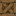

# Fortcraft Lucky Block

lucky block project for fortcraft minigame for minecraft version 1.20.1

## Download instructions

This add-on was made needs [Forge version 47.4.0](https://files.minecraftforge.net/net/minecraftforge/forge/index_1.20.1.html) using [Lucky block v13.0](https://www.curseforge.com/minecraft/mc-mods/lucky-block/files/4817267), [Vic's Point Blank v1.9.6](https://www.curseforge.com/minecraft/mc-mods/vics-point-blank/files/6012485), [Vic's Point Blank - Trauma v0.7](https://www.curseforge.com/minecraft/customization/vics-point-blank-trauma/files/6471350), [Red Dead Weaponry v1.7](https://www.curseforge.com/minecraft/customization/red-dead-weaponry/files/6024417), [Modern Conflict: Revamped v0.9.5](https://www.curseforge.com/minecraft/customization/modern-conflict-rearmed/files/6560829), [Grappling Hook - Reforged](https://www.curseforge.com/minecraft/mc-mods/grappling-hook-mod-reforged/files/6028357), [Hang Glider v8.0.1](https://www.curseforge.com/minecraft/mc-mods/hang-glider/files/4710223) and [LesRaisins Armor v0.1.4.3](https://www.curseforge.com/minecraft/mc-mods/lesraisins-armor/files/5686783) with relative dependencies in order to work properly.

To install this add-on first start the game with Lucky block mod installed, then opening the game's folder extract the zipped file in the `.minecraft/addons/lucky/` folder.

>[!WARNING]
>just put the zip files you find in the downloaded zip folder without extracting them
